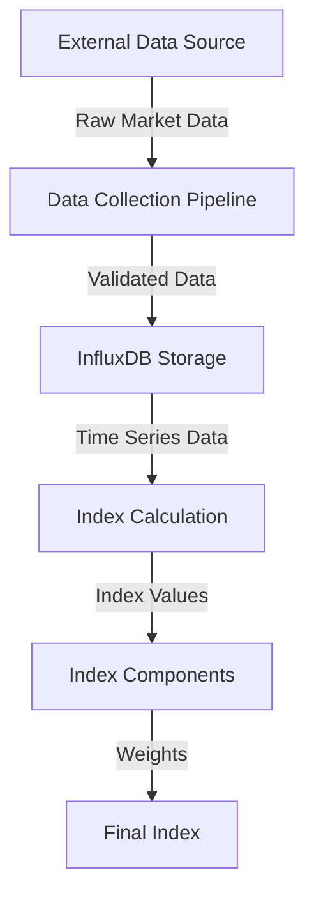

@matthewmorganstein
# defi-manifold-index
## A DeFi Index based on High-Dimensional Data Simplification

# De-Fi Manifold Index: A New DeFi Index Model

The Manifold Index is a tool designed to track the performance of the DeFi cryptocurrency market using advanced mathematical techniques to identify patterns and relationships between different cryptocurrencies.

Unlike traditional indexes that focus on a specific sector or asset class, the Manifold Index considers the entire Defi cryptocurrency market-segment as a complex system. The index uses manifold learning techniques to identify underlying patterns and structures in the market data. The index constituents are selected based on their relevance and importance in the market, rather than being fixed or based on market capitalization.

The index provides a more comprehensive and nuanced view of the DeFi cryptocurrency market. By identifying patterns and relationships between different cryptocurrencies, the index can potentially help investors manage risk more effectively. The index could also potentially help investors identify new investment opportunities and optimize their portfolios.

# Index Computation

The index is calculated using a weighted formula that considers the market capitalization, trading volume, liquidity, and risk-parity of the constituent assets.

## Technical Documentation

### Table of Contents
1. [Overview](#overview)
2. [System Architecture](#system-architecture)
3. [Installation](#installation)
4. [Configuration](#configuration)
5. [API Reference](#api-reference)
6. [Data Models](#data-models)
7. [Usage Examples](#usage-examples)
8. [Error Handling](#error-handling)
9. [Best Practices](#best-practices)
10. [Troubleshooting](#troubleshooting)

## Overview

The Manifold Feature Index (MFI) is a sophisticated system for tracking and analyzing DeFi crypto assets using manifold learning techniques. It provides a mathematical framework for index construction while maintaining compatibility with the RISE SDK infrastructure.

### Key Features
- Automated constituent selection using manifold learning
- Multiple weighting methodologies
- Real-time data collection and processing
- Efficient caching system
- Comprehensive error handling
- Scalable architecture

## System Architecture

### Components
1. **ManifoldFeatureIndex**
   - Core index calculation engine
   - Implements manifold learning algorithms
   - Handles constituent selection

2. **ManifoldIndexManager**
   - Manages data collection workflow
   - Handles database schema
   - Coordinates index updates

3. **RISEIndicatorSDK Integration**
   - Data storage and retrieval
   - Caching system
   - Error handling framework

### Data Flow


## Installation

### Prerequisites
- Node.js v14 or higher
- InfluxDB 2.0+
- TypeScript 4.5+

### Setup
```bash
# Install dependencies
npm install @influxdata/influxdb-client ml-matrix axios winston

# Install development dependencies
npm install --save-dev typescript @types/node

# Build project
npm run build
```

## Configuration

### Environment Variables
```env
INFLUXDB_URL=your_influxdb_url
INFLUXDB_TOKEN=your_token
INFLUXDB_ORG=your_org
INFLUXDB_BUCKET=your_bucket
API_KEY=your_api_key
API_BASE_URL=your_api_base_url
```

### Index Configuration
```typescript
interface ManifoldFeatureConfig {
    lookbackPeriod: number;     // Days
    constituentCount: number;    // Number of assets in index
    updateFrequency: number;     // Days between updates
    weightingMethod: string;     // 'marketCap'|'volume'|'liquidity'|'riskParity'
    manifoldDimension: number;   // Dimension of manifold space
}
```

## API Reference

### ManifoldFeatureIndex Class

#### Constructor
```typescript
constructor(sdk: RISEIndicatorSDK, config: ManifoldFeatureConfig)
```

#### Methods
```typescript
async calculateIndex(timestamp?: Date): Promise<number>
async updateConstituents(): Promise<void>
async getConstituents(): Promise<IndexComponent[]>
```

### ManifoldIndexManager Class

#### Constructor
```typescript
constructor(
    sdk: RISEIndicatorSDK, 
    index: ManifoldFeatureIndex,
    dataSourceConfig: DataSourceConfig
)
```

#### Methods
```typescript
async setupSchema(): Promise<void>
async startDataCollection(symbols: string[]): Promise<void>
async calculateAndStoreIndex(): Promise<void>
```

## Data Models

### Market Data Schema
```typescript
interface MarketData {
    symbol: string;
    price: number;
    marketCap: number;
    volume: number;
    timestamp: Date;
}
```

### Index Component Schema
```typescript
interface IndexComponent {
    symbol: string;
    weight: number;
    lastUpdated: Date;
}
```

## Usage Examples

### Basic Index Setup
```typescript
// Initialize SDK
const sdk = await RISEIndicatorSDK.initialize(config);

// Create index instance
const index = new ManifoldFeatureIndex(sdk, {
    lookbackPeriod: 365,
    constituentCount: 20,
    updateFrequency: 7,
    weightingMethod: 'riskParity',
    manifoldDimension: 3
});

// Initialize manager
const manager = new ManifoldIndexManager(sdk, index, dataSourceConfig);

// Start index workflow
await manager.setupSchema();
await manager.startDataCollection(symbols);
await manager.calculateAndStoreIndex();
```

### Custom Weight Calculation
```typescript
async function calculateCustomWeights(constituents: IndexComponent[]): Promise<void> {
    const totalWeight = constituents.reduce((sum, c) => sum + c.weight, 0);
    constituents.forEach(c => {
        c.weight = c.weight / totalWeight;
    });
}
```

## Error Handling

The system implements a comprehensive error handling strategy:

### Error Types
- `ConnectionError`: Database connection issues
- `WriteError`: Data writing failures
- `ValidationError`: Data validation failures
- `QueryError`: Query execution issues

### Error Recovery
```typescript
try {
    await manager.calculateAndStoreIndex();
} catch (error) {
    if (error instanceof ConnectionError) {
        await reconnectDatabase();
    } else if (error instanceof WriteError) {
        await retryWrite();
    }
}
```

## Best Practices

1. **Data Validation**
   - Always validate incoming market data
   - Check for missing or invalid values
   - Implement proper error handling

2. **Performance Optimization**
   - Use caching for frequently accessed data
   - Implement batch processing for writes
   - Monitor query performance

3. **Monitoring**
   - Log important operations
   - Track index calculation times
   - Monitor constituent changes

## Troubleshooting

### Common Issues

1. **Connection Failures**
   ```
   Error: Failed to connect to InfluxDB
   Solution: Check credentials and network connectivity
   ```

2. **Data Validation Errors**
   ```
   Error: Invalid market data
   Solution: Verify data source and format
   ```

3. **Index Calculation Issues**
   ```
   Error: Failed to calculate index
   Solution: Check constituent data and weights
   ```

### Debug Tools
```typescript
// Enable debug logging
logger.level = 'debug';

// Run diagnostic tests
await manager.runDiagnostics();
```

For additional support or questions, please refer to the RISE SDK documentation or contact the development team.
